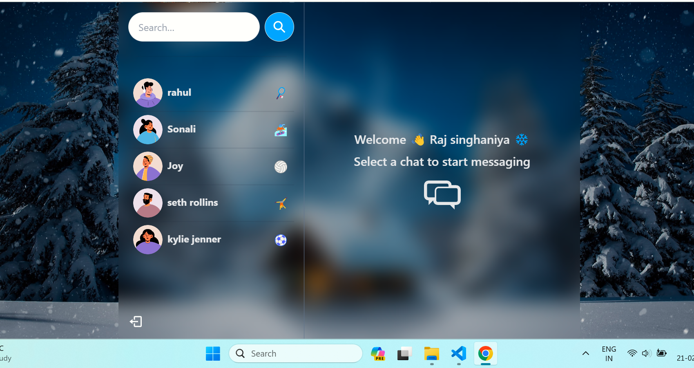

# MERN Stack Real-Time Chat App

A decoupled, high-performance real-time chat application built with **React, Express, Socket.io, and MongoDB**. Designed for deployment with **Backend on Render** and **Frontend on Cloudflare Pages**.



## 🌟 Features
- ⚡ **Decoupled Architecture**: Independent frontend and backend deployments.
- 🎃 **Authentication & Authorization**: Secure JWT with HTTP-only cross-site cookies.
- 👾 **Real-Time Messaging**: Socket.io real-time chat and typing/notification sounds.
- 🚀 **Online User Status**: Dynamic presence indicators.
- 🎨 **Modern Glassmorphic UI**: TailwindCSS + DaisyUI.
- 👌 **State Management**: Zustand & React Context.

---

## 🛠️ Project Structure
```
mern-chat-app/
├── backend/            # Express, Socket.io, Mongoose API (Standalone)
│   ├── controllers/
│   ├── db/
│   ├── middleware/
│   ├── models/
│   ├── routes/
│   ├── socket/
│   ├── utils/
│   ├── .env.example
│   ├── package.json
│   └── server.js
├── frontend/           # Vite + React + TailwindCSS SPA (Standalone)
│   ├── public/
│   │   └── _redirects  # Cloudflare Pages SPA Routing
│   ├── src/
│   ├── .env.example
│   ├── package.json
│   └── vite.config.js
├── DEPLOYMENT.md       # Complete deployment guide
└── README.md
```

---

## 🚀 Quick Start (Local Development)

### 1. Install Dependencies
```bash
# Backend
cd backend && npm install

# Frontend
cd ../frontend && npm install
```

### 2. Configure Environment Variables
- Create `backend/.env`:
```env
PORT=5000
MONGO_DB_URI=your_mongodb_connection_string
JWT_SECRET=your_jwt_secret
NODE_ENV=development
FRONTEND_URL=http://localhost:3000
```

- Create `frontend/.env`:
```env
VITE_BACKEND_URL=http://localhost:5000
```

### 3. Run Development Servers
- **Backend** (Terminal 1):
```bash
cd backend
npm run dev
```
- **Frontend** (Terminal 2):
```bash
cd frontend
npm run dev
```

---

## 🌐 Production Deployment
See [DEPLOYMENT.md](./DEPLOYMENT.md) for full deployment instructions:
- **Backend on Render**: Root directory `backend`, Start command `npm start`.
- **Frontend on Cloudflare Pages**: Root directory `frontend`, Build command `npm run build`, Output directory `dist`.

